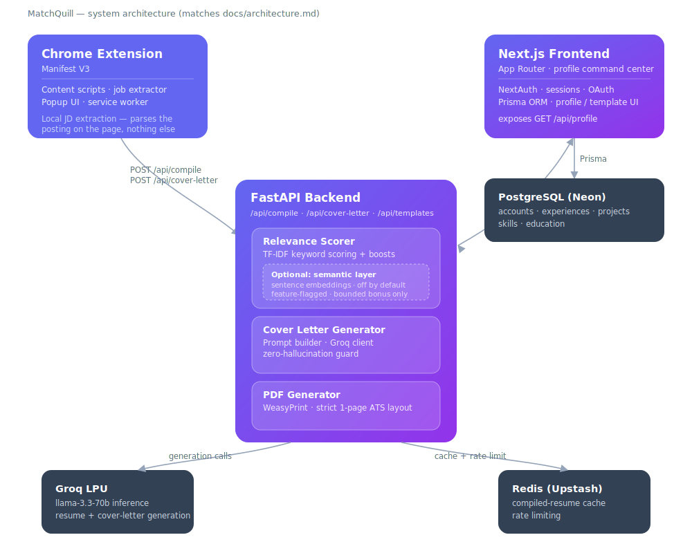
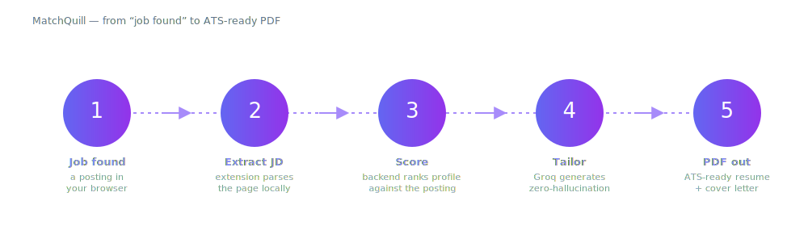

<p align="center">
  
</p>

<p align="center">
  <b>The career compiler.</b> Read a job description straight off the page, then compile a
  tailored, ATS-ready resume and cover letter from your real experience — inventing nothing.
</p>

<p align="center">
  
  
  
  
  
</p>

<p align="center">
  Next.js frontend · FastAPI backend · Chrome MV3 extension · Groq generation · WeasyPrint PDF · Redis cache
</p>

---

## Contents

- [What it does](#what-it-does)
- [The three pillars](#the-three-pillars)
- [Architecture](#architecture)
- [Components](#components)
- [How it works](#how-it-works)
- [Getting started](#getting-started)
- [Semantic matching (optional)](#semantic-matching-optional)
- [How MatchQuill compares](#how-matchquill-compares)
- [Roadmap](#roadmap)
- [Status](#status)
- [License](#license)

---

## What it does

MatchQuill turns the posting in front of you into a document tailored to it — without pasting,
reformatting, or fabricating anything. The flow is three steps:

1. **Capture.** The Chrome extension (Manifest V3) extracts the job description **locally** from the
   page you are viewing — supported boards and ATS front-ends include LinkedIn, Indeed, Glassdoor,
   Greenhouse, Lever, and Workday, with added support for Naukri, Wellfound, ZipRecruiter, Ashby,
   SmartRecruiters, iCIMS, and Workable.
2. **Score.** The backend scores your validated profile against the posting to decide which
   experiences, projects, and skills to lead with.
3. **Compile.** Groq-powered generation produces a tailored resume and cover letter, rendered to a
   clean, ATS-friendly PDF via WeasyPrint. Redis caches repeat generations.

Think of your past achievements as source code and the job description as the target architecture —
MatchQuill compiles one into the other, and never writes source you didn't author.

## The three pillars

- **Local JD extraction.** You don't paste a job description into a scanner — the extension parses
  the posting where it lives and drives the compiler in one click.
- **Zero-hallucination compilation.** Generation is constrained to your actual, validated profile.
  MatchQuill rephrases, reorders, and highlights what you've genuinely done; it does not invent
  titles, metrics, or projects. *(This is a design constraint on generated content, not an
  independently audited guarantee.)*
- **Optional semantic matching.** On top of keyword relevance, an **optional** semantic layer uses
  sentence embeddings to recognize when your experience is phrased differently than the posting but
  means the same thing. It is **off by default** — see [Semantic matching](#semantic-matching-optional).

## Architecture

MatchQuill is a monorepo with three deployable surfaces — the extension captures, the frontend owns
the profile and identity, and the FastAPI backend does the scoring, generation, and rendering. All
generation state (accounts, experiences, projects, skills) lives in Postgres; Groq handles inference
and Redis absorbs repeat work.

<p align="center">
  
</p>

## Components

| Component | Stack | Role |
|---|---|---|
| **Frontend** | Next.js (App Router), Prisma, NextAuth | The command center for your professional profile, templates, and generation UI. Owns identity and exposes the validated profile to the backend. |
| **Backend** | FastAPI, WeasyPrint, Groq, Redis | The intelligence layer: relevance scoring, zero-hallucination generation, ATS PDF rendering, and caching. |
| **Extension** | Chrome Manifest V3, content scripts | The capture surface: extracts the job description locally from the page and drives the compiler. |

## How it works

The path from a posting to a finished document is a single pipeline. The extension extracts the JD
locally, the backend fetches your validated profile and scores it against the posting, Groq tailors
the copy under a zero-hallucination constraint, and WeasyPrint renders the ATS-ready PDF.

<p align="center">
  
</p>

Concretely, for a resume compile:

1. The extension extracts the job description from the posting and sends `POST /api/compile` with the
   user id and the JD.
2. The backend fetches the user profile from the frontend's `GET /api/profile`.
3. The `RelevanceScorer` analyzes the JD and scores each profile item (experience, project, skill).
4. It selects the top-N items per the chosen template's config.
5. WeasyPrint renders a clean, 1-page ATS-friendly PDF.
6. The result is cached in Redis and returned to the extension.

Cover letters follow the same shape (`POST /api/cover-letter`), except the prompt is built from
**only** your profile data before it reaches Groq — the model is told to use those facts and invent
nothing.

## Getting started

MatchQuill runs as two local services plus the unpacked extension. You'll need Python 3.9+, Node.js,
Postgres, and a Groq API key. See [`AGENTS.md`](AGENTS.md) for the full development guide.

**Backend (FastAPI)** — from `backend/`:

```bash
pip install -r requirements.txt
uvicorn app.main:app --reload --port 8000
```

**Frontend (Next.js)** — from `frontend/`:

```bash
npm install
npm run dev
```

**Extension (Chrome MV3)** — load `extension/` as an unpacked extension via
`chrome://extensions` → *Developer mode* → *Load unpacked*.

Configure secrets through environment variables (Groq API key, database URL, auth secrets, Redis) —
never hardcode them. The backend degrades gracefully: if Redis or the optional semantic dependency
isn't present, keyword scoring and generation still work.

## Semantic matching (optional)

On top of the TF-IDF keyword score, the `RelevanceScorer` can blend in embedding-based cosine
similarity so that paraphrased-but-equivalent experience is recognized — for example, *"led
cross-functional teams"* matching a JD asking for *"project management experience"* even when they
share no keywords.

This layer is **off by default**. Specifically:

- It is gated behind the `semantic_matching` feature flag (`FEATURE_FLAGS=semantic_matching`, see
  `backend/app/config.py`).
- It requires an **optional install** (`sentence-transformers`, `torch`), kept out of the default
  dependencies in `backend/requirements-semantic.txt`.
- When enabled, semantic similarity is added as a **bounded bonus on top of** the keyword score —
  never a replacement. Embeddings are cached so each text is embedded at most once.
- If the dependency isn't installed or fails to load, the layer degrades to a no-op and keyword
  scoring is never at risk. API response shapes are unchanged either way.

```bash
# From backend/ — enable the optional layer
pip install -r requirements.txt -r requirements-semantic.txt
FEATURE_FLAGS=semantic_matching uvicorn app.main:app --port 8000
```

> Honesty note: this is an **optional capability**, not a default-on guarantee. Its production
> performance is not independently verified, and semantic matching is **not unique to MatchQuill** —
> other tools in this category do embedding-based matching too. We ship it off, and we don't claim
> benchmark numbers we haven't measured.

## How MatchQuill compares

The nearest open-source comparison is **[srbhr/Resume-Matcher](https://github.com/srbhr/Resume-Matcher)**
— a popular, genuinely open-source ATS resume tool. Credit where due: it runs locally with 100+ LLMs
(including Ollama for fully local inference), has an embedding-based semantic matching layer at its
core, ships ATS-friendly templates, and shares a similar Next.js + FastAPI stack. If you want a
self-hostable, local-first matcher, it's a strong choice.

Two honest points of difference:

- **Real-time JD capture via a browser extension.** Resume-Matcher takes the job description by
  manual paste and does not ship a browser extension. MatchQuill's defining workflow is a Chrome MV3
  extension that extracts the posting locally from the page across a broad set of boards and ATS
  front-ends.
- **A zero-hallucination compilation constraint** as the framing of the generation step — grounding
  output in validated profile data rather than free-writing.

Where MatchQuill is **not** differentiated, stated plainly: semantic matching is not unique to it,
and tools like Teal and Huntr also ship Chrome extensions (theirs are built primarily to *save jobs
into a tracker*; MatchQuill's exists to *extract the JD and drive compilation*). See
[`docs/launch-content/`](docs/launch-content/) for the sourced comparisons.

## Roadmap

- Broader board and ATS front-end coverage for the extractor.
- Additional industry-standard resume templates.
- Deeper company-research context feeding the compiler.
- Hardening and independent verification of the optional semantic layer before it is ever promoted
  from opt-in.

## Status

The domain **`matchquill.com` is the intended domain but is not yet confirmed purchased**, and the
name's trademark is not yet cleared. See [`docs/naming-decision.md`](docs/naming-decision.md). Do not
treat the name or domain as final.

## License

MIT © MatchQuill contributors. See [`LICENSE`](LICENSE).
